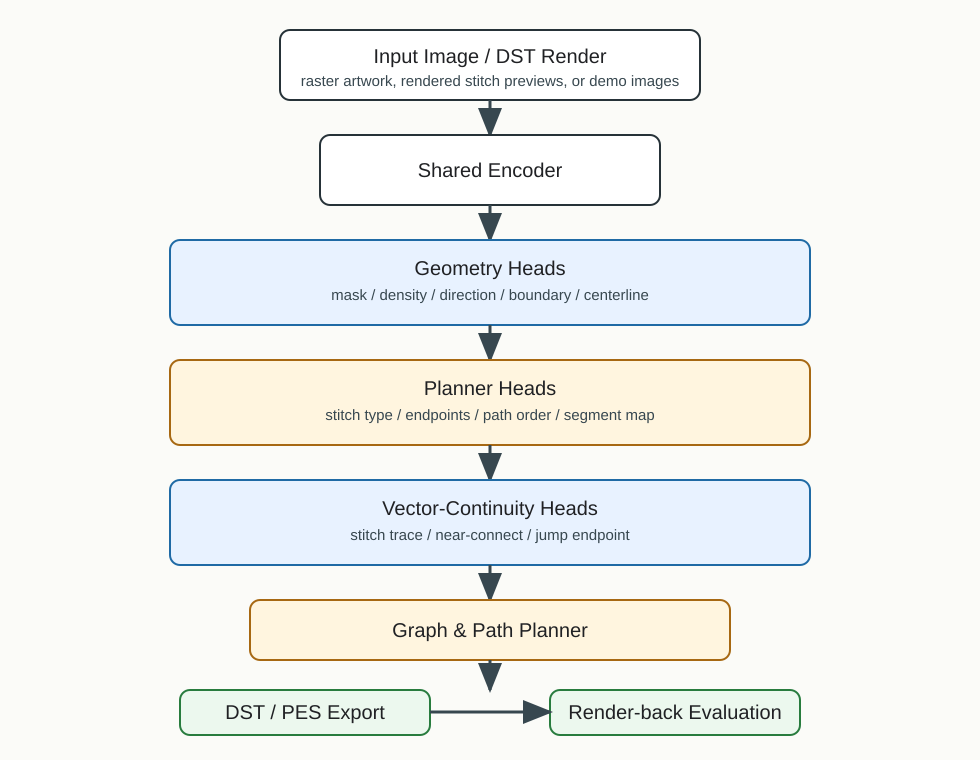

# Image-to-Embroidery Stitch Planning

Research prototype for converting raster images into machine-embroidery structure and DST/PES outputs.

For a minimal run, start with [QUICKSTART.md](QUICKSTART.md).

The project is not a simple image filter. The current pipeline is:

```text
input image / DST-rendered preview
  -> geometry prediction
  -> mask, density, direction, boundary, centerline
  -> stitch type, endpoints, path order
  -> vector-continuity and jump-risk supervision
  -> conservative planner priors and retrieval controls
  -> relation-aware transition cost
  -> graph/path planning
  -> DST/PES export and render-back evaluation
```

## Current Direction

The latest stable research direction is a geometry-to-planner model with vector-continuity supervision:

- predict embroidery regions and geometry;
- preserve centerline and boundary structure;
- predict entry/exit endpoints and path order;
- penalize disconnected vector paths and long jumps;
- export legal DST/PES files through `pyembroidery`;
- evaluate both model maps and machine-executable stitch metrics.

## Important Models

The current promoted geometry checkpoint is model13:

```text
model13_multiformat_all_vector_continuity_20260514
```

Model14B is kept as a later geometry-continuity experiment, but it was not promoted as the main checkpoint.

The current best planner selector package is:

```text
configs/best_current_model_m2_74_professional_texture_profile.json
results/public_benchmark_v1_ext33_m2_74_professional_texture_profile/
```

M2.74 is the current professional-texture profile. It promotes four shape/icon samples to satin-like outputs while keeping `0` hard_fail, `0` visible connectors, no off-mask increase, and `0` low-adaptive-precision samples. The current public benchmark metrics are `0.056399` mean unified loss, `6.030303` mean jump count, `0.981039` coverage, `0.837796` strict precision, `0.967046` adaptive stitch precision, and `0.208606` mean texture score across 33 public benchmark images.

M2.73 remains the strict no-regression texture gate when jump/loss must not increase. M2.72 remains the line-art skeleton-fidelity layer for selected QuickDraw samples. M2.71 remains as the no-regression guard that blocks unsafe route/segment candidates. M2.70 remains the earlier jump-relief profile for `qd_002 / dog`. M2.74 is the first profile in this line that intentionally accepts a small jump/loss cost for higher stitch-type texture, better coverage, and better precision.

M2.75 adds the first stitch-type teacher dataset for the next learned planner. It expands the M2.74 texture decision into 165 `(sample, candidate)` rows with geometry features, command metrics, texture deltas, professional gate labels, utility scores, and teacher choices. M2.75 is a training substrate, not a new DST output profile; see [docs/m2_75_stitch_type_teacher_dataset.md](docs/m2_75_stitch_type_teacher_dataset.md).

M2.76 adds the first learned stitch-type selector prototype on top of M2.75. The gate-assisted leave-one-out selector reproduces M2.74 choices exactly on 33 public benchmark images, but metric-only variants recover only one of four texture promotions. This means M2.76 is a useful learned-selector bridge and diagnostic result, while M2.74 remains the promoted DST output profile. See [docs/m2_76_learned_stitch_type_selector.md](docs/m2_76_learned_stitch_type_selector.md).

M2.77 adds source-held-out validation for the stitch-type selector. It holds out whole source families instead of individual samples. The gate-assisted selector still reproduces M2.74 exactly, but metric-only source-held-out variants recover `0/4` texture promotions and the no-gate variant over-promotes texture on unsafe sources. This confirms that current professional stitch-type selection still depends on gate-derived supervision and needs more real DST/PES stitch-type teacher data before it should replace M2.74. See [docs/m2_77_source_heldout_stitch_type_selector.md](docs/m2_77_source_heldout_stitch_type_selector.md).

M2.78 adds a broader stitch-type teacher seed table for the next professional planner. It merges the M2.18 multi-candidate oracle table with the M2.75 professional texture teacher table, expanding supervision to `660` candidate rows with `66` positive teacher rows across `base_keep`, `running_line`, `auto_fill`, `fill_tatami_like`, `auto_running`, `satin_like`, and `outline_border`, plus `274` hard negatives. This is the data-layer response to the M2.77 metric-only failure; it is not a new DST output profile. See [docs/m2_78_stitch_type_teacher_seed.md](docs/m2_78_stitch_type_teacher_seed.md).

M2.79 trains the first source-held-out multi-family stitch selector on the M2.78 seed table. The baseline confirms that the broader seed supports non-base family learning (`0.8919` non-base positive accuracy), but it also creates too many unsafe texture promotions. The safer risk-guarded `rejectw4` variant improves overall source-held-out accuracy to `0.7411`, raises reject recall to `0.7333`, and reduces false texture promotions from `51` to `6`. M2.79 is a selector prototype and safety audit, not a new promoted DST output profile. See [docs/m2_79_stitch_family_selector.md](docs/m2_79_stitch_family_selector.md).

M2.80 adds a conservative deployment policy on top of the M2.79 `rejectw4` selector. Risky stitch-family predictions must now beat `reject` by a `0.20` score margin before deployment. On source-held-out validation this raises accuracy from `0.7411` to `0.8423`, raises reject recall from `0.7333` to `0.8630`, and removes false texture promotions (`6 -> 0`) while keeping non-base positive accuracy at `0.5676`. M2.80 is the safety gate for future learned stitch-family deployment; M2.74 remains the promoted DST output profile. See [docs/m2_80_stitch_family_deployment_policy.md](docs/m2_80_stitch_family_deployment_policy.md).

M2.81 adds a non-leaky professional-gate feature (`allowed_by_professional_gate`) to the stitch-family selector and then applies the learned selector plus deployment margin to the real M2.75 texture candidate pool. It keeps false texture promotions at `0`, improves non-base positive accuracy over M2.80 (`0.5676 -> 0.6757`), and reproduces the current M2.74 professional DST outputs exactly (`33` samples checked, `0` SHA256 DST differences). M2.74 remains the promoted output profile; M2.81 is the current learned-control layer for that profile. See [docs/m2_81_professional_gate_selector.md](docs/m2_81_professional_gate_selector.md).

M2.82 expands the M2.81 learned-control layer from the texture-only candidate pool into a broader executable multi-family audit covering running, fill, tatami-like, satin-like, outline, and style-aware candidates. Under conservative no-regression gates it finds `19` promotable non-base rows and selects `5` non-base sample outputs while keeping `0` hard_fail, `0` visible connectors, unchanged mean jumps/trims/off-mask length, and slightly higher mean coverage/precision. The aggregate gain is small, so M2.82 is the latest experimental multi-family candidate policy rather than a final professional digitizer. See [docs/m2_82_multifamily_candidate_policy.md](docs/m2_82_multifamily_candidate_policy.md).

M2.83 adds a DST-derived stitch-preview texture audit. It reads generated DST trajectories directly, renders local stitch previews, and scores direction structure, stitch density, stitch-length rhythm, generator texture, coverage/precision, and command safety. This audit shows that M2.82 is command-safe but not visually stronger than M2.81 under the preview-texture proxy: mean preview score changes from `0.730075` to `0.729761`, with `0` improved samples and `2` worse samples. This makes M2.83 the current quality gate for future professional-looking promotion; the next policy should use M2.83 to block command-safe but texture-worse candidates. See [docs/m2_83_dst_preview_texture_audit.md](docs/m2_83_dst_preview_texture_audit.md).

M2.84 applies that quality gate. It keeps the M2.82 command-safe candidates only when the M2.83 preview-texture score and generator texture score do not regress. It retains `3` neutral multi-family substitutions, rejects `ocp_005` and `omj_003` because their preview score regressed, and restores the M2.81 aggregate preview score (`0.730075`) while keeping `0` hard_fail, `0` visible connectors, unchanged jumps/trims, and unchanged off-mask length. M2.84 is the current professional-quality guardrail: it prevents visually worse DST outputs from being promoted even if command metrics look safe. See [docs/m2_84_preview_gated_multifamily_policy.md](docs/m2_84_preview_gated_multifamily_policy.md).

M2.85 turns that guardrail into a positive reranker. It audits all `627` executable non-base rows from the M2.82 candidate pool with the M2.83 DST-derived preview metric, finds `219` rows with positive preview score, and identifies `1` candidate that also passes command safety and learned deployment gates: `ocp_005 / satinrail_safeadt_light`. This raises mean professional preview score from `0.730075` to `0.730474` and mean precision from `0.837796` to `0.838044` with no increase in hard_fail, jumps, trims, visible connectors, off-mask length, or unified loss. The gain is small but it is the first preview-positive step in this line. See [docs/m2_85_preview_aware_candidate_reranker.md](docs/m2_85_preview_aware_candidate_reranker.md).

M2.86 expands that preview-positive search from the M2.82 decision table to all existing ext33 generator roots with command and coverage rows. It audits `48` candidate roots / `1584` candidate rows, finds `924` rows with positive preview score, and selects `7` strict-gated sample switches. Mean professional preview score increases from M2.85's `0.730474` to `0.735441`, mean generator texture score increases from `0.207697` to `0.226121`, mean precision increases from `0.838044` to `0.839183`, mean off-mask length decreases from `0.121206` to `0.106191`, and hard_fail / visible connectors remain `0`. The tradeoff is a small accepted increase in mean jumps (`6.030303 -> 6.151515`) and unified loss (`0.056399 -> 0.057069`). M2.86 is the current preview-aware sweep selector, not yet a complete professional digitizer. See [docs/m2_86_preview_candidate_sweep_selector.md](docs/m2_86_preview_candidate_sweep_selector.md).

See [MODEL_CARD.md](MODEL_CARD.md) for metrics and checkpoint notes.

## Research Contributions

1. DST-derived supervision dataset: real embroidery files are parsed/rendered into dense geometry, planning, and continuity labels rather than treated as ordinary image pairs.
2. Multi-task embroidery representation: the model predicts mask, density, direction, boundary, centerline, stitch type, endpoints, path order, segment structure, and continuity maps.
3. Path-continuity learning: vector-continuity labels and planner-side penalties target broken outlines, long jumps, and disconnected stitch traces before DST/PES export.
4. Conservative continuity-aware planning: fixed planner priors for component filtering, near-connect stitching, short-stitch limits, and path ordering substantially reduce jump/trim commands in command-level ablations.
5. Anti-overfit planner controls: leave-one-out, external-index, random-prior, shuffled-prior, and fixed-prior controls are used to separate true retrieval gains from planner-parameter effects.
6. Executability-first evaluation: DST/PES outputs are scored with command-level jump, trim, long-stitch, round-trip parse, and render-back visual checks.
7. Unified planner selection: command metrics and visual-risk metrics are combined into a single `ExecScore + VisualRisk` objective for B1/B1_clean planner sweeps.
8. Geometry-to-Graph-to-TSP planning: predicted stitch regions are converted into polyline graph nodes, then ordered with TSP-style edge costs that penalize jump, trim, off-mask, and visible-connector risk.
9. Strict M1 learned planner selection: NumPy MLP models map image/geometry summaries directly to planner presets or continuous planner configs, while the earlier ridge scorer is kept as an M0.9 candidate-scoring bridge. A pairwise ranking selector is included as a preference-learning experiment, but current tiny-sample results show overfit risk rather than a confirmed improvement.
10. M2 learned edge-policy reranker: `graph_tsp_trace.json` route decisions are converted into edge-level ranking data, then a pairwise ranker is optionally injected back into Graph-TSP as a local next-node utility reranker.

## Architecture



```text
Input Image / DST Render
        |
Shared Encoder
        |
Geometry Heads
(mask / density / direction / boundary / centerline)
        |
Planner Heads
(stitch type / endpoints / path order / segment map)
        |
Vector-Continuity Heads
(stitch trace / near-connect / jump endpoint)
        |
Graph & Path Planner
(segment/polyline graph + TSP-style edge optimization)
        |
DST / PES Export
        |
Render-back Evaluation
```

## Dataset

The recommended main training dataset is:

```text
datasets/dataset4_multiformat_all_geometry_graph
```

It is a DST-derived multi-task supervision dataset. It contains:

- rendered preview/label images;
- mask, density, direction, boundary, centerline;
- stitch type labels;
- endpoint heatmaps;
- segment maps;
- path graph JSON;
- vector-continuity labels.

The full dataset is too large for normal Git history. This repository package includes manifests and instructions. Put the full datasets under `datasets/` after cloning.

For a lightweight smoke test, use the mini demo dataset under:

```text
datasets/mini_demo
```

See [DATASET_CARD.md](DATASET_CARD.md).

## Optimization Tools

The current high-priority optimization path is implemented as three practical tools.

### Enhanced DST-Derived Labels

Build richer labels directly from DST/PES command streams:

```powershell
python build_dst_label_v2.py `
  --dst-dir path/to/embroidery_files `
  --output-dir datasets/dst_label_v2 `
  --limit 100
```

This creates `stitch_trace`, `same_color_near_connect`, `long_jump_endpoint`, `trim_endpoint`, `color_change_endpoint`, `closure_gap_endpoint`, and `path_order` maps, plus segment and path-event JSON files.

### Conservative and Retrieval-Augmented Planner

Create a small planner index from demo or training images:

```powershell
python retrieval_augmented_planner.py `
  --image-dir datasets/mini_demo/inputs `
  --output datasets/mini_demo/retrieval_planner_index.json
```

Use the index during inference:

```powershell
python infer_model3_portrait_hybrid.py inputs/your_image.png `
  --checkpoint checkpoints/best_model13_multiformat_all_vector_continuity.pt `
  --output-dir outputs/your_image_model13 `
  --geometry-planner `
  --model-path-order `
  --use-continuity-planner `
  --retrieval-index datasets/mini_demo/retrieval_planner_index.json `
  --planner-config configs/relation_planner.yaml `
  --serpentine-fill
```

The `summary.json` records the retrieved matches and the final planner values applied to DST/PES export. Current ablations show that the strongest improvement comes from a conservative fixed planner prior, while retrieval-specific gains require controls before they should be claimed.

### Relation-Aware Planner Cost

`configs/relation_planner.yaml` enables the A1/A2 planner-only ablation path from the research report. It adds normalized distance, jump/trim risk, lock risk, near-connect bonus, direction alignment, endpoint compatibility, and retrieval-prior terms to the transition cost.

### Graph-TSP Planner

The current paper-oriented planner route is `Geometry-to-Graph-to-TSP`: generated stitch polylines become graph nodes, and transition edges are scored by distance, long-jump risk, trim risk, off-mask risk, and visible connector risk.

```powershell
python infer_model3_portrait_hybrid.py inputs/your_image.png `
  --checkpoint checkpoints/best_model13_multiformat_all_vector_continuity.pt `
  --output-dir outputs/your_image_graph_tsp `
  --geometry-planner `
  --model-path-order `
  --use-continuity-planner `
  --planner-config configs/relation_planner.yaml `
  --graph-tsp-planner `
  --mask-safe-connectors `
  --serpentine-fill
```

The `b2_graph_tsp_conservative_safe` preset in `configs/sweep_b1.yaml` is the current hard-selection candidate. In the latest 4-sample paired holdout sweep, it reduced mean unified loss and visual-risk metrics compared with the conservative B1 baseline, but still increased jump count, so it should be treated as an optimization direction rather than a final production planner.

When `--graph-tsp-planner` is enabled, inference also writes `graph_tsp_trace.json`, containing graph nodes, selected transition edges, route node IDs, and edge-risk details. This is the bridge artifact for M1 learned preset selection and future M2 edge-level GNN routing.

### M0.9 and Strict M1 Planner Selectors

Two selector stages are available:

- M0.9 candidate scorer: scores image/geometry + candidate preset features.
- Strict M1 direct selector: predicts one planner preset/config from image/geometry features with an MLP and cross-entropy loss.
- M1 continuous config regressor: predicts numeric planner parameters from image/geometry features with an MLP and MSE loss, then runs the generated config through DST/PES export.
- M1 ranking selector: learns evaluator-derived pairwise preferences between candidate configs. This is useful for preference-learning research, but current 4-sample leave-one-out results underperform the continuous config regressor.

Run the M0.9 candidate-scoring loop:

```powershell
python tools/run_m1_selector_loop.py --config configs/m1_selector.yaml
```

This builds `results/m1_selector/latest_pair_20260618/m1_selector_samples.jsonl`, trains a leave-one-out ridge selector, and saves `checkpoints/m1_planner_selector.json`.

Run the strict M1 direct loop:

```powershell
python tools/run_m1_direct_loop.py --config configs/m1_direct_selector.yaml
```

This trains `checkpoints/m1_direct_selector.json` and applies it to produce `results/m1_direct_selector/latest_pair_20260618/m1_direct_selected_configs.json`.

Run the stronger continuous-config M1 loop:

```powershell
python tools/run_m1_config_loop.py --config configs/m1_config_regressor.yaml
```

Current 4-sample result:

| Selector / Baseline | Unified Loss | Jumps | Trims | Visible Connectors | Off-Mask mm |
| --- | ---: | ---: | ---: | ---: | ---: |
| M2 edge policy top4, DST-evaluated | 0.607582 | 192.750 | 20.250 | 32.500 | 171.912 |
| M1 continuous config regressor, DST-evaluated | 0.621028 | 143.500 | 25.250 | 35.750 | 179.303 |
| Oracle preset label | 0.621038 | 143.250 | 25.250 | 35.750 | 178.987 |
| Strict M1 direct preset MLP | 0.621038 | 143.250 | 25.250 | 37.000 | 178.229 |
| M0.9 candidate scorer | 0.621367 | 154.000 | 24.250 | 35.500 | 176.804 |
| Fixed B2 Graph-TSP conservative | 0.626582 | 213.500 | 26.250 | 35.250 | 175.534 |
| Fixed B1 conservative | 0.636772 | 130.750 | 25.250 | 37.000 | 185.828 |

See [docs/m1_planner_selector.md](docs/m1_planner_selector.md) for M1 details, [docs/m2_edge_policy.md](docs/m2_edge_policy.md) for the M2 prototype, and [docs/closed_loop_learning_risks.md](docs/closed_loop_learning_risks.md) for credit-assignment and reward-hacking boundaries.

Run the ranking-preference M1 loop:

```powershell
python tools/run_m1_ranking_loop.py --config configs/m1_ranking_selector.yaml
```

Current 4-sample result:

| Selector / Baseline | Unified Loss | Hard Score | Jumps | Trims | Visible Connectors | Off-Mask mm |
| --- | ---: | ---: | ---: | ---: | ---: | ---: |
| M1 ranking selector | 0.621812 | 53.670513 | 157.500 | 24.250 | 40.250 | 176.956 |
| M1 continuous config regressor, DST-evaluated | 0.621028 | 41.953114 | 143.500 | 25.250 | 35.750 | 179.303 |
| Oracle preset label | 0.621038 | 51.903530 | 143.250 | 25.250 | 35.750 | 178.987 |

Interpretation: the ranking selector is now implemented and reproducible, but this small benchmark says it is not yet the best M1 choice. Treat it as a preference-learning diagnostic until the sweep dataset grows beyond the current 4 paired holdout samples.

### M2 Edge Policy Prototype

M2 is the local decision layer: it learns which graph node should be stitched next from the current node and remaining candidates.

Build the edge-decision dataset from Graph-TSP traces and train the M2 ranker:

```powershell
python tools/run_m2_edge_policy_loop.py --config configs/m2_edge_policy.yaml
```

Current leave-one-sample-out result:

| M2 Prototype | Decisions | Accuracy | Top-3 Accuracy | Mean Oracle Rank |
| --- | ---: | ---: | ---: | ---: |
| Edge utility ranker | 1074 | 0.478585 | 0.780261 | 3.000 |

This satisfies the first M2 stage:

```text
graph_tsp_trace -> edge dataset -> learned edge utility -> LOO validation
```

It now also satisfies the M2-DST integration smoke stage:

```text
Graph-TSP candidate edges -> optional M2 utility rerank -> DST/PES export -> executability eval
```

Run inference with the learned edge utility enabled:

```powershell
python infer_model3_portrait_hybrid.py inputs/your_image.png `
  --checkpoint checkpoints/best_model13_multiformat_all_vector_continuity.pt `
  --output-dir outputs/your_image_m2_top4 `
  --planner-config configs/relation_planner.yaml `
  --geometry-planner `
  --model-path-order `
  --use-continuity-planner `
  --serpentine-fill `
  --graph-tsp-planner `
  --mask-safe-connectors `
  --m2-edge-policy checkpoints/m2_edge_policy.json `
  --m2-edge-policy-top-k 4 `
  --m2-hard-safe-filter `
  --m2-safe-min-inside-fraction 0.96 `
  --m2-jump-aware-weight 0.25 `
  --m2-offmask-weight 0.5 `
  --m2-visible-weight 1.0 `
  --m2-trim-weight 0.25 `
  --safe-connect-repair `
  --safe-connect-repair-max-mm 20.0 `
  --safe-connect-repair-min-inside-fraction 0.90 `
  --safe-connect-repair-global-mask
```

Current paired-holdout command-level result:

| Method | Unified Loss | Hard Score | Jumps | Trims | Visible Connectors | Off-Mask mm |
| --- | ---: | ---: | ---: | ---: | ---: | ---: |
| M2.1 global safe-connect repair20 | 0.580058 | 37.151575 | 83.000 | 15.500 | 32.500 | 173.146 |
| M2.2 retrained policy + repair20 | 0.581322 | 37.187846 | 82.000 | 15.750 | 32.500 | 173.646 |
| M2 edge policy top4 | 0.607582 | 41.652422 | 192.750 | 20.250 | 32.500 | 171.912 |
| M2 edge policy top2 | 0.608222 | 41.888061 | 196.750 | 21.750 | 32.500 | 171.912 |
| M2 edge policy top8 | 0.610504 | 42.110343 | 203.500 | 20.750 | 32.500 | 171.912 |
| M1 continuous config regressor | 0.621028 | 41.953114 | 143.500 | 25.250 | 35.750 | 179.303 |
| Fixed B2 Graph-TSP conservative | 0.626582 | 44.170873 | 213.500 | 26.250 | 35.250 | 175.534 |
| Fixed B1 conservative | 0.636772 | 42.691112 | 130.750 | 25.250 | 37.000 | 185.828 |

Interpretation: this table records the earlier 4-sample paired-holdout stage, where M2.1 global safe-connect repair20 was the best M2 decoding result. It reduced mean unified loss by 4.53% relative to M2 top4 and cut mean jumps from 192.75 to 83.00 while keeping visible connector count unchanged. M2.2 retraining on hard-mined traces was tested, but it did not beat the deterministic repair20 decode, so it is kept as an artifact rather than the promoted setting.

Historical note: at the earlier fill-inset stage, M2.34 superseded M2.1 on the 33-sample public benchmark. The current promoted planner selector has since advanced through M2.70/M2.71/M2.72/M2.73 to M2.74, while M2.75-M2.86 build the learned stitch-type planner data, validation, selector, deployment-safety, professional-gate control layer, multi-family executable candidate audit, DST-derived preview-texture quality gate, preview-gated multi-family deployment guardrail, preview-positive candidate reranker, and preview-aware generator-root sweep selector. M2.34 and M2.1 are retained as historical baselines; see [docs/public_benchmark_ext33_validation.md](docs/public_benchmark_ext33_validation.md), [docs/m2_34_fill_inset_notes.md](docs/m2_34_fill_inset_notes.md), [docs/m2_72_line_skeleton_profile.md](docs/m2_72_line_skeleton_profile.md), [docs/m2_73_stitch_type_texture_profile.md](docs/m2_73_stitch_type_texture_profile.md), [docs/m2_74_professional_texture_profile.md](docs/m2_74_professional_texture_profile.md), [docs/m2_75_stitch_type_teacher_dataset.md](docs/m2_75_stitch_type_teacher_dataset.md), [docs/m2_77_source_heldout_stitch_type_selector.md](docs/m2_77_source_heldout_stitch_type_selector.md), [docs/m2_78_stitch_type_teacher_seed.md](docs/m2_78_stitch_type_teacher_seed.md), [docs/m2_79_stitch_family_selector.md](docs/m2_79_stitch_family_selector.md), [docs/m2_80_stitch_family_deployment_policy.md](docs/m2_80_stitch_family_deployment_policy.md), [docs/m2_81_professional_gate_selector.md](docs/m2_81_professional_gate_selector.md), [docs/m2_82_multifamily_candidate_policy.md](docs/m2_82_multifamily_candidate_policy.md), [docs/m2_83_dst_preview_texture_audit.md](docs/m2_83_dst_preview_texture_audit.md), [docs/m2_84_preview_gated_multifamily_policy.md](docs/m2_84_preview_gated_multifamily_policy.md), [docs/m2_85_preview_aware_candidate_reranker.md](docs/m2_85_preview_aware_candidate_reranker.md), and [docs/m2_86_preview_candidate_sweep_selector.md](docs/m2_86_preview_candidate_sweep_selector.md).

Run command-level executability evaluation after export:

```powershell
python tools/eval_executability.py `
  --pred outputs/your_image_model13/embroidery_output.dst `
  --mask outputs/your_image_model13/hybrid_export_mask.png `
  --report outputs/your_image_model13/executability_eval.json
```

Passing `--mask` enables visual tradeoff metrics such as `off_mask_stitch_length_mm` and `visible_connector_count`, which help detect cases where lower jump/trim counts are achieved by visible stitch connectors across blank regions.

Score one or more executability reports with the unified objective from the latest research direction:

```powershell
python tools/score_unified.py `
  --eval-glob "outputs/latest_dataset_pair_eval_20260615/**/executability_eval.json" `
  --config configs/sweep_b1.yaml `
  --output-csv results/b1_sweep/unified_scores.csv `
  --output-md results/b1_sweep/unified_scores.md
```

Run a B1/B1_clean planner sweep on image/mask cases:

```powershell
python tools/run_b1_sweep.py `
  --pair-root datasets/incoming_review/latest_dataset_20260615/organized/pairing_review_NOT_FOR_TRAINING_YET/paired_candidates_FOR_APPROVAL_NOT_TRAINING `
  --target-root outputs/latest_dataset_pair_eval_20260615/model13_relation_fixed_no_training `
  --config configs/sweep_b1.yaml `
  --output-dir results/b1_sweep/latest_pairs `
  --cpu
```

Select the B1_clean recommendation from scored rows:

```powershell
python tools/select_b1_clean.py `
  --scores-csv results/b1_sweep/latest_pairs/sweep_results.csv `
  --sweep-config configs/sweep_b1.yaml `
  --selection-policy hard `
  --output-dir results/pareto/b1_clean_latest_pairs
```

Run the full A0/A1/A2 mini-demo ablation:

```powershell
python tools/run_planner_ablation.py `
  --input-dir datasets/mini_demo/inputs `
  --output-dir outputs/planner_ablation_mini_demo `
  --limit 12 `
  --cpu
```

This writes `metrics.csv`, `summary.json`, and `comparison.md`. Use `--reuse` to skip samples that already have an `executability_eval.json`.

Run the anti-overfit controls:

```powershell
python tools/run_planner_ablation.py `
  --input-dir datasets/mini_demo/inputs `
  --output-dir outputs/planner_ablation_mini_demo_controls `
  --limit 12 `
  --include-validation-controls `
  --external-retrieval-index outputs/retrieval_indices/dataset4_multiformat_all_index.json `
  --cpu
```

The control report includes `A2_fixed_params`, `A2_leave_one_out`, `A2_external_index`, `A2_random_prior`, and `A2_shuffled_prior`. If these match `A2_retrieval_relation`, the result should be interpreted as a planner-parameter improvement rather than proof that retrieval itself generalizes.

Create a render-back visual report for the same ablation folder:

```powershell
python tools/make_planner_visual_report.py `
  --ablation-dir outputs/planner_ablation_mini_demo_controls `
  --output-dir outputs/planner_visual_report
```

Use the contact sheet to check whether lower `jump_count` and `trim_count` are achieved by adding visible stitch connectors across blank regions.

Run a train/validation-style fixed-parameter sweep:

```powershell
python tools/sweep_fixed_planner_params.py `
  --input-dir datasets/mini_demo/inputs `
  --output-dir outputs/fixed_planner_param_sweep `
  --limit 12 `
  --train-count 6 `
  --cpu
```

The sweep report ranks fixed planner presets with both command-level metrics and visual tradeoff penalties. Use it before promoting a new fixed planner preset.

See [docs/research_roadmap_report24.md](docs/research_roadmap_report24.md) for the current research direction after the overfit controls.

### Render Augmentation

Create fabric, lighting, blur, color, and noise variants without changing geometry labels:

```powershell
python augment_render_inputs.py `
  --dataset-dir datasets/dataset4_multiformat_all_geometry_graph `
  --manifest manifest_dataset2.csv `
  --output-dir datasets/dataset4_render_augmented `
  --variants 2
```

Use this for robustness experiments before moving to heavier generative models such as CVAE, cGAN, diffusion, or autoregressive DST sequence modeling.

### Real-Image Canonicalization

Preprocess a real or panel-style input into an embroidery-design-like image before inference:

```powershell
python tools/preprocess_real_image.py inputs/your_image.png `
  --output-dir outputs/your_image_preprocess `
  --colors 10
```

The tool writes `canonical_input.png`, `foreground_mask.png`, `edge_map.png`, and `color_quantized.png`. For wide diagnostic panels it automatically crops the left input tile before resizing. Use both the raw-cropped image and the canonical image in ablations: raw crops may preserve fill/satin behavior better, while canonicalized images can reduce noisy fragments and emphasize outlines.

For real embroidery photos, use the newer v2 preprocessing path. It produces thread-only, region-reconstructed, and selected masks:

```powershell
python tools/preprocess_real_image_v2.py inputs/your_photo.png `
  --output-dir outputs/your_photo_preprocess_v2 `
  --colors 10

python infer_model3_portrait_hybrid.py outputs/your_photo_preprocess_v2/selected_design.png `
  --checkpoint checkpoints/best_model13_multiformat_all_vector_continuity.pt `
  --output-dir outputs/your_photo_model13_v2 `
  --geometry-planner `
  --model-path-order `
  --use-continuity-planner `
  --planner-config configs/relation_planner.yaml `
  --external-foreground-mask outputs/your_photo_preprocess_v2/selected_mask.png `
  --serpentine-fill
```

See [docs/research_direction_report25_zh.md](docs/research_direction_report25_zh.md) and [docs/hitl_protocol_zh.md](docs/hitl_protocol_zh.md) for the current research protocol.

## Install

```powershell
python -m venv .venv
.\.venv\Scripts\python.exe -m pip install --upgrade pip
.\.venv\Scripts\python.exe -m pip install -r requirements.txt
```

PyTorch is required by both training and inference code. For explicit installs:

```powershell
.\.venv\Scripts\python.exe -m pip install -r requirements-cpu.txt
```

or, for a CUDA 12.1 example:

```powershell
.\.venv\Scripts\python.exe -m pip install -r requirements-gpu.txt
```

If your CUDA version differs, install the matching PyTorch wheel from the official PyTorch selector, then install the rest of this repository's requirements.

## Train

Example continuation training:

```powershell
python train_model10_vector_continuity.py `
  --dataset-dir datasets/dataset4_multiformat_all_geometry_graph `
  --output-dir models/model13_multiformat_all_vector_continuity `
  --init-checkpoint checkpoints/best_model13_multiformat_all_vector_continuity.pt `
  --epochs 24
```

## Inference

Example:

```powershell
python infer_model3_portrait_hybrid.py inputs/your_image.png `
  --checkpoint checkpoints/best_model13_multiformat_all_vector_continuity.pt `
  --output-dir outputs/your_image_model13 `
  --geometry-planner `
  --model-path-order `
  --use-continuity-planner `
  --retrieval-index datasets/mini_demo/retrieval_planner_index.json `
  --planner-config configs/relation_planner.yaml `
  --serpentine-fill
```

## Artifact Policy

Normal Git should contain code, documentation, small examples, and manifests. Large artifacts should be uploaded separately:

- checkpoints: Git LFS or GitHub Releases;
- full datasets: GitHub Releases, DVC remote, Hugging Face Dataset, or external storage;
- generated outputs: keep local unless they are selected figures.

See [GITHUB_UPLOAD_GUIDE.md](GITHUB_UPLOAD_GUIDE.md).
